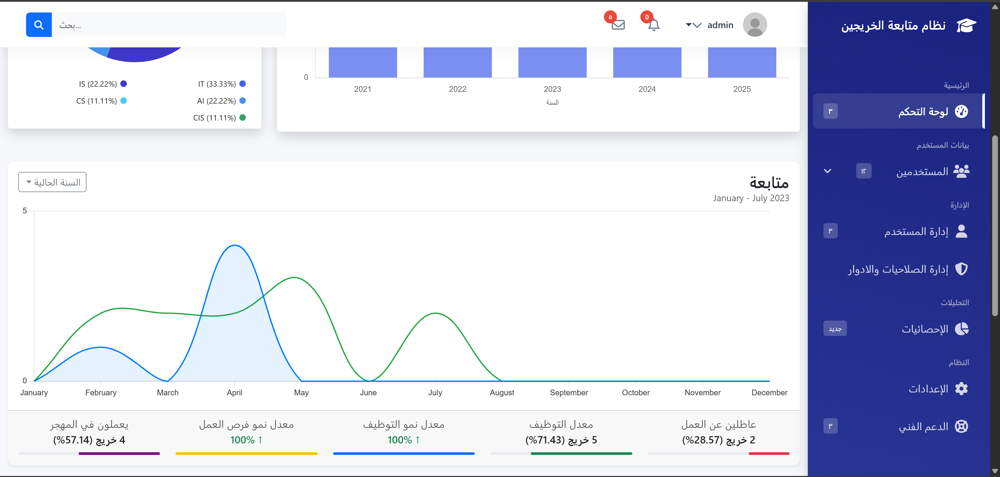

## 📘 About College Graduate Tracking System

The **College Graduate Tracking System** is a web-based application designed to help colleges and universities manage and monitor their graduates’ career progress.  
It enables administrators to collect alumni data, track employment statistics, and generate insightful reports for accreditation and institutional development.

### 🎯 Key Features
- 👨‍🎓 Manage graduate profiles and academic history  
- 💼 Track employment status and career progression  
- 📊 Generate analytical reports and visual dashboards  
- 📨 Facilitate communication between alumni and institutions  
- 🔒 Secure authentication and role-based access

---

## 🖼️ Screenshots

### 🎓 Dashboard

### 👤 Graduate Profile

---

## 🏗️ Tech Stack
- Frontend: HTML, CSS, JavaScript   
- Backend: PHP (Laravel Framework)  
- Database: MySQL  

